# Osgiliath Architecture Diagrams

**Project:** Osgiliath - AI-Assisted Full-Stack ERP Assessment  
**Date:** November 7, 2025  
**Version:** 1.0
 
---

## Table of Contents

1. [System Overview](#1-system-overview)
2. [Clean Architecture Layers](#2-clean-architecture-layers)
3. [Domain-Driven Design (DDD) Bounded Contexts](#3-domain-driven-design-bounded-contexts)
4. [CQRS Pattern Implementation](#4-cqrs-pattern-implementation)
5. [Vertical Slice Architecture](#5-vertical-slice-architecture)
6. [Database Schema](#6-database-schema)
7. [API Architecture](#7-api-architecture)
8. [Frontend Architecture (MVVM)](#8-frontend-architecture-mvvm)
9. [Request Flow Diagrams](#9-request-flow-diagrams)
10. [Deployment Architecture](#10-deployment-architecture)

---

## 1. System Overview

### High-Level System Architecture

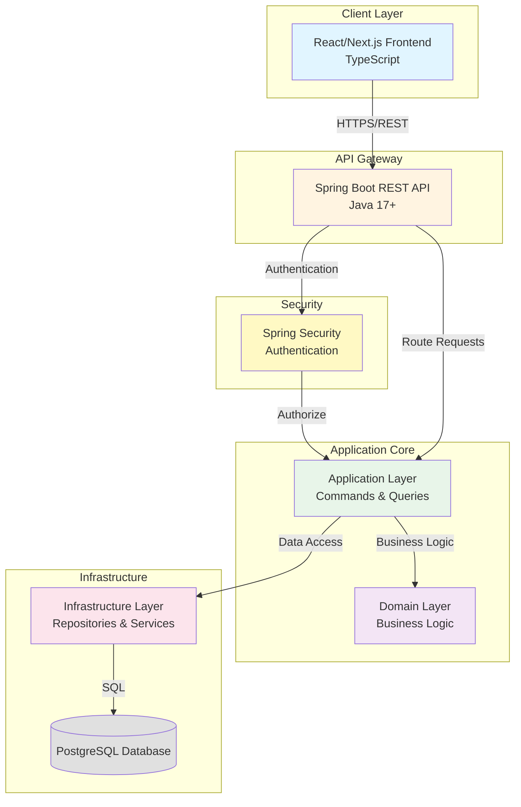

---

## 2. Clean Architecture Layers

### Dependency Flow and Layer Separation

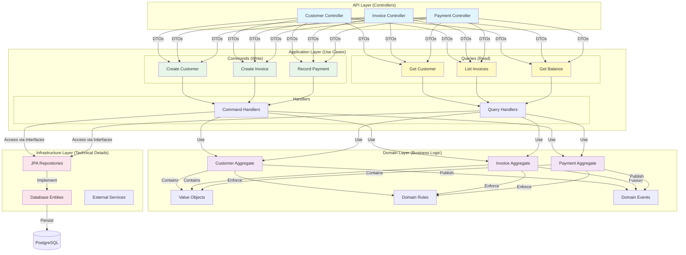

### Dependency Rule Visualization

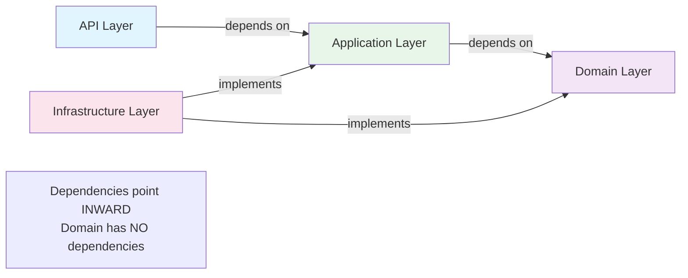

---

## 3. Domain-Driven Design (DDD) Bounded Contexts

### Bounded Contexts and Aggregates

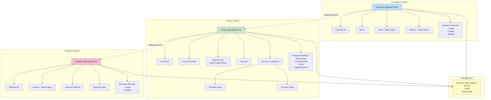

### Aggregate Relationships

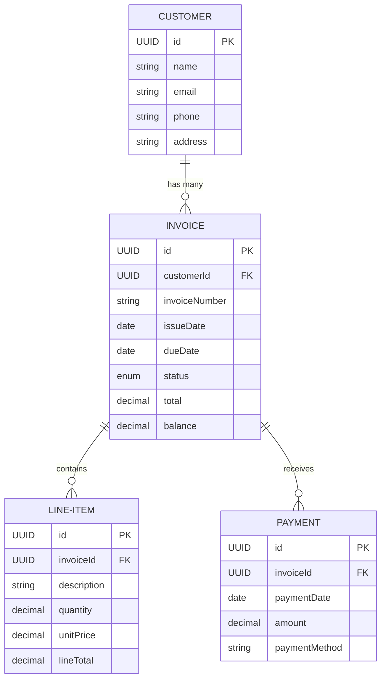

---

## 4. CQRS Pattern Implementation

### Command and Query Separation

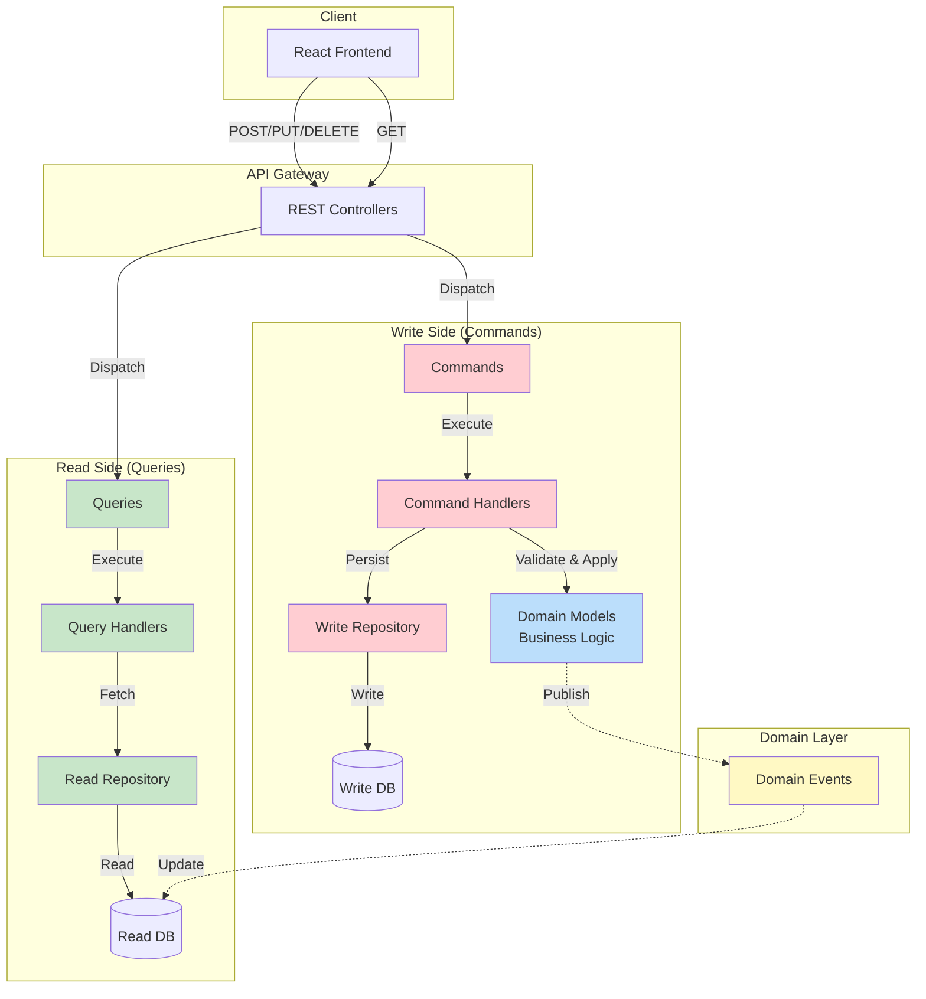

### Command Flow Example: Create Invoice

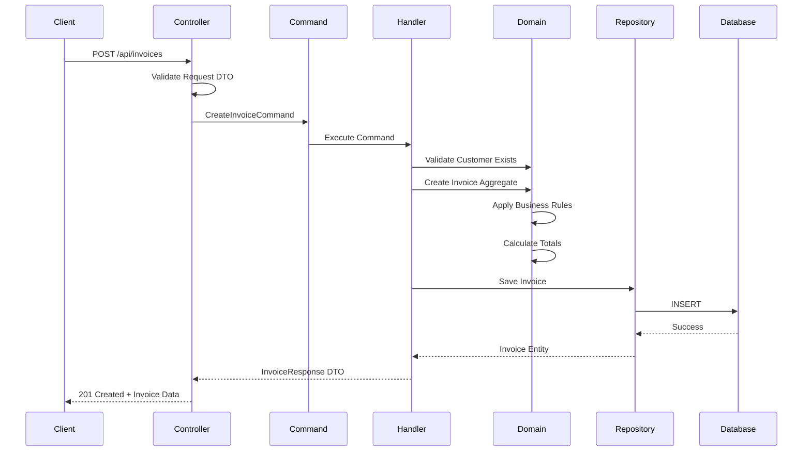

### Query Flow Example: Get Invoice

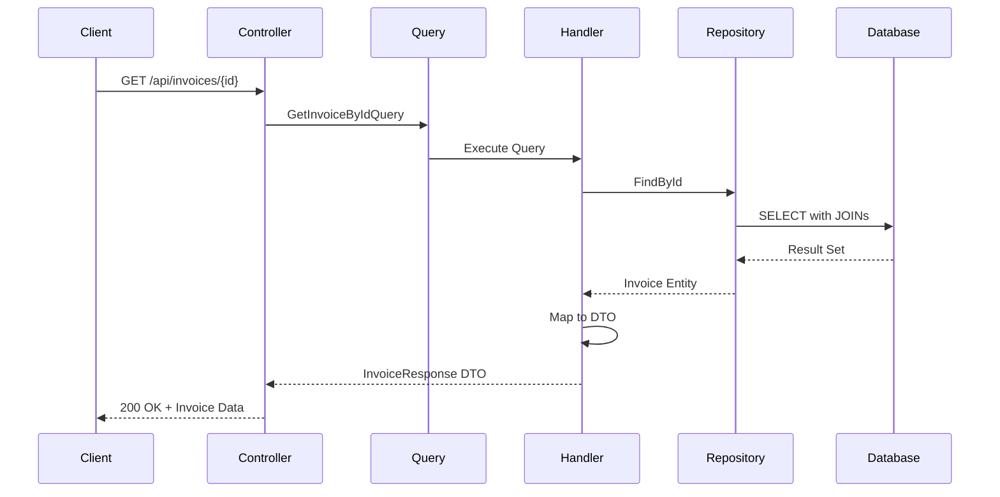

---

## 5. Vertical Slice Architecture

### Feature-Based Organization

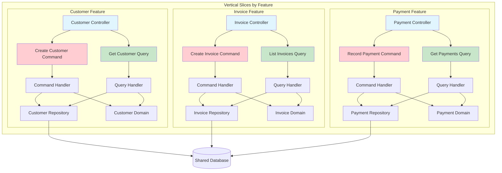

### Directory Structure (Vertical Slice)

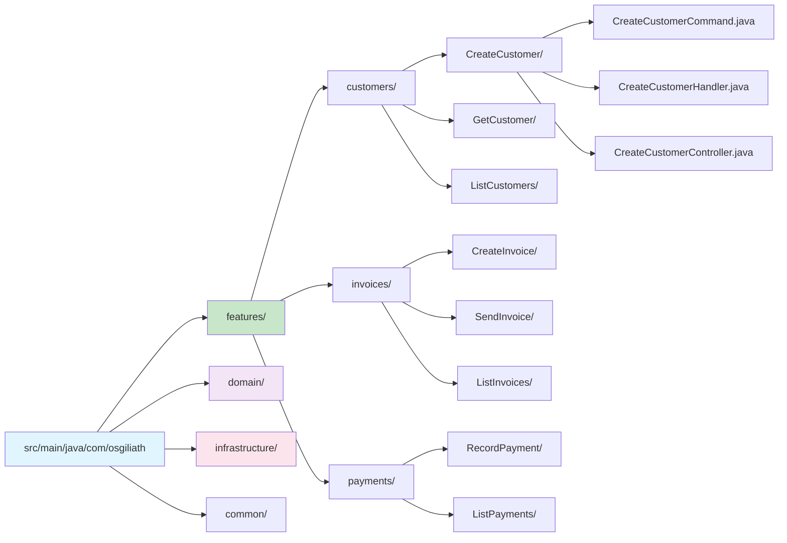

---

## 6. Database Schema

### Entity Relationship Diagram

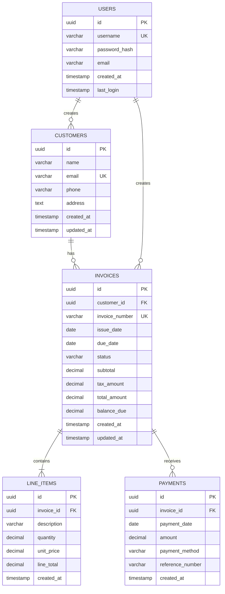

### Database Indexes

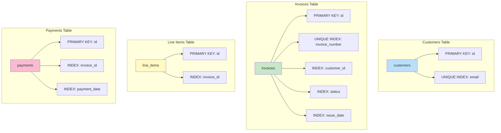

---

## 7. API Architecture

### REST API Endpoints

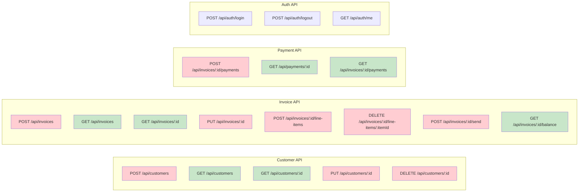

### API Request/Response Flow

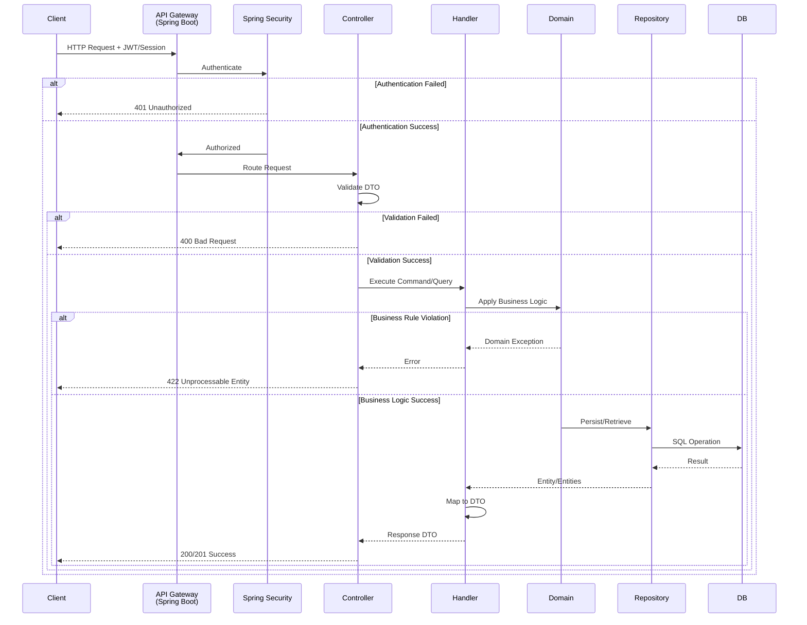

---

## 8. Frontend Architecture (MVVM)

### MVVM Pattern Structure

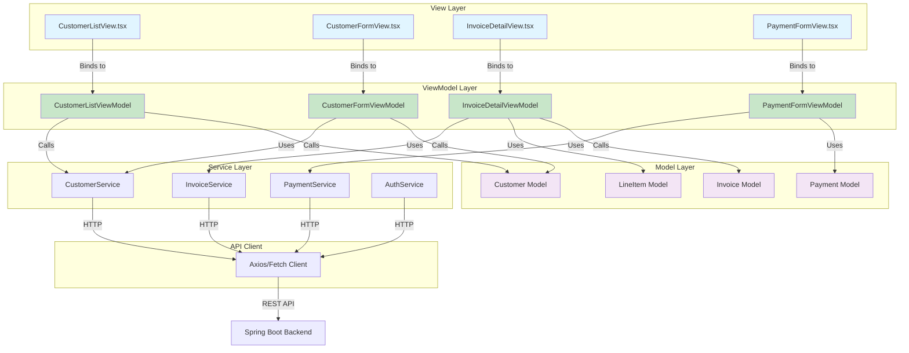

### Frontend Directory Structure

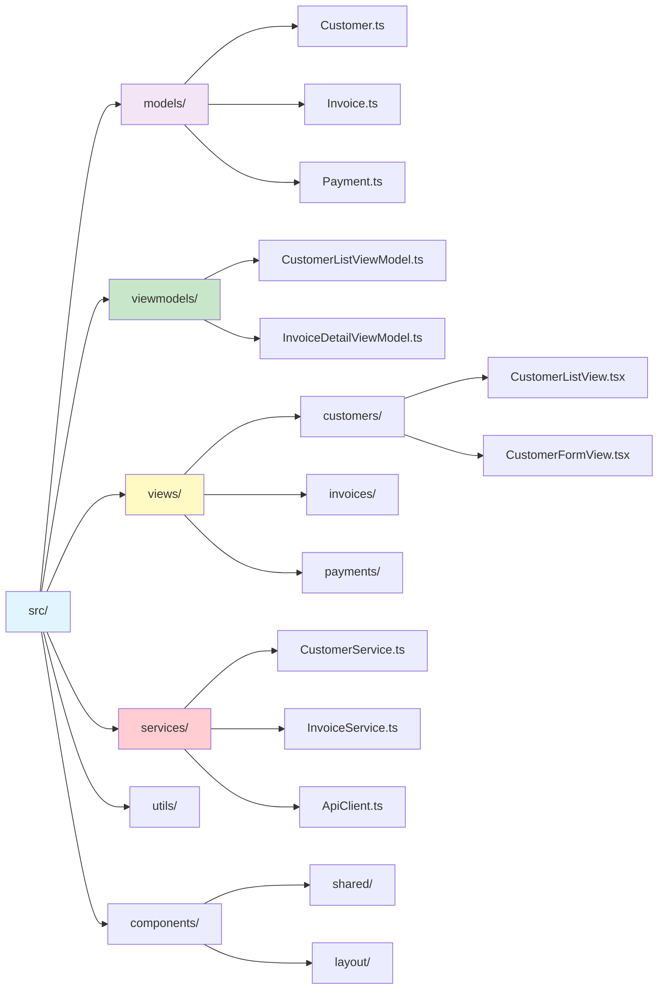

### React Component Data Flow

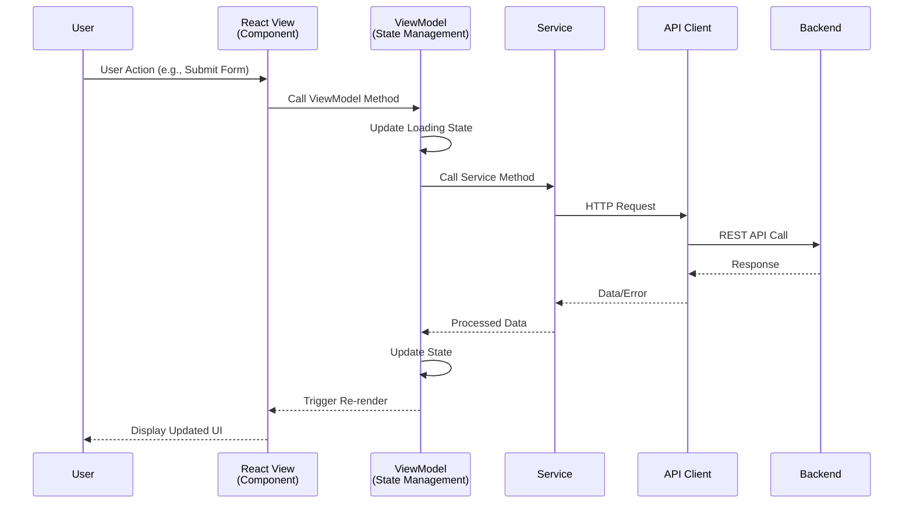

---

## 9. Request Flow Diagrams

### Complete Request Flow: Create Invoice with Payment

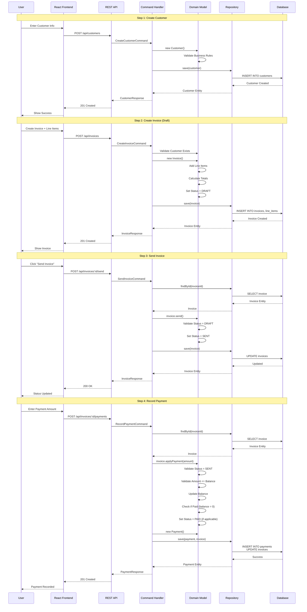

### Invoice Lifecycle State Machine

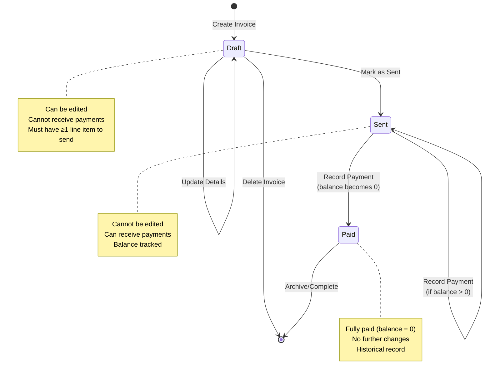

---

## 10. Deployment Architecture

### Local Development Environment

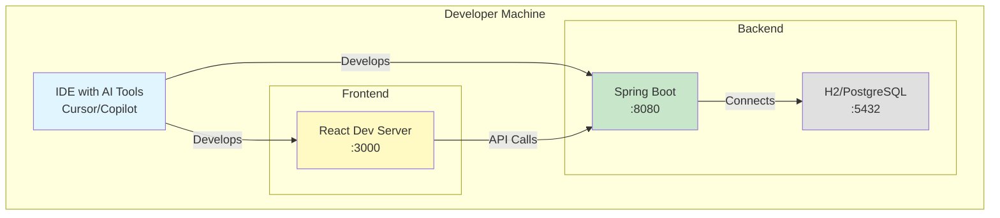

### Production Deployment (AWS Example)

```mermaid
graph TB
    subgraph "Client"
        USER[Web Browser]
    end
    
    subgraph "AWS Cloud"
        subgraph "Edge"
            CF[CloudFront CDN]
        end
        
        subgraph "Compute"
            ALB[Application Load Balancer]
            EC2A[EC2 Instance 1<br/>Spring Boot]
            EC2B[EC2 Instance 2<br/>Spring Boot]
        end
        
        subgraph "Storage"
            RDS[(RDS PostgreSQL<br/>Multi-AZ)]
            S3[S3 Bucket<br/>Static Assets]
        end
        
        subgraph "Security"
            SG[Security Groups]
            IAM[IAM Roles]
        end
    end
    
    USER -->|HTTPS| CF
    CF -->|Static Content| S3
    CF -->|API Requests| ALB
    ALB -->|Load Balance| EC2A
    ALB -->|Load Balance| EC2B
    EC2A -->|SQL| RDS
    EC2B -->|SQL| RDS
    
    SG -.->|Protect| EC2A
    SG -.->|Protect| EC2B
    SG -.->|Protect| RDS
    IAM -.->|Authorize| EC2A
    IAM -.->|Authorize| EC2B
    
    style USER fill:#e1f5ff
    style CF fill:#fff9c4
    style ALB fill:#c8e6c9
    style EC2A fill:#ffcdd2
    style EC2B fill:#ffcdd2
    style RDS fill:#e0e0e0
    style S3 fill:#f3e5f5
```

### Production Deployment (Azure Example)

```mermaid
graph TB
    subgraph "Client"
        USER[Web Browser]
    end
    
    subgraph "Azure Cloud"
        subgraph "Edge"
            CDN[Azure CDN]
        end
        
        subgraph "Compute"
            APPGW[Application Gateway]
            APP1[App Service 1<br/>Spring Boot]
            APP2[App Service 2<br/>Spring Boot]
        end
        
        subgraph "Storage"
            SQLDB[(Azure SQL Database)]
            BLOB[Blob Storage<br/>Static Assets]
        end
        
        subgraph "Security"
            NSG[Network Security Groups]
            KV[Key Vault]
        end
    end
    
    USER -->|HTTPS| CDN
    CDN -->|Static Content| BLOB
    CDN -->|API Requests| APPGW
    APPGW -->|Route| APP1
    APPGW -->|Route| APP2
    APP1 -->|SQL| SQLDB
    APP2 -->|SQL| SQLDB
    APP1 -->|Secrets| KV
    APP2 -->|Secrets| KV
    
    NSG -.->|Protect| APP1
    NSG -.->|Protect| APP2
    
    style USER fill:#e1f5ff
    style CDN fill:#fff9c4
    style APPGW fill:#c8e6c9
    style APP1 fill:#ffcdd2
    style APP2 fill:#ffcdd2
    style SQLDB fill:#e0e0e0
    style BLOB fill:#f3e5f5
```

### Container-Based Deployment (Docker)

```mermaid
graph TB
    subgraph "Docker Compose Environment"
        subgraph "Frontend Container"
            NGINX[Nginx<br/>React Build]
        end
        
        subgraph "Backend Container"
            SPRING[Spring Boot App<br/>Java 17]
        end
        
        subgraph "Database Container"
            POSTGRES[(PostgreSQL 15)]
        end
        
        subgraph "Network"
            NET[app-network]
        end
    end
    
    NGINX -->|Proxy API| SPRING
    SPRING -->|JDBC| POSTGRES
    
    NGINX -.->|Connected| NET
    SPRING -.->|Connected| NET
    POSTGRES -.->|Connected| NET
    
    style NGINX fill:#fff9c4
    style SPRING fill:#c8e6c9
    style POSTGRES fill:#e0e0e0
    style NET fill:#e1f5ff
```

---

## Architecture Decision Records (ADR)

### ADR-001: Clean Architecture with DDD

**Decision**: Implement Clean Architecture with Domain-Driven Design

**Rationale**:
- Separation of concerns enables independent testing and maintenance
- Domain logic isolation protects business rules
- Infrastructure independence allows technology swaps
- Aligns with enterprise-grade system requirements

**Consequences**:
- More initial setup complexity
- Steeper learning curve
- Better long-term maintainability
- Clear architectural boundaries

---

### ADR-002: CQRS Pattern

**Decision**: Separate Commands (writes) from Queries (reads)

**Rationale**:
- Clear separation of responsibilities
- Optimized read and write models
- Easier to scale independently
- Explicit intent in code

**Consequences**:
- More boilerplate code initially
- Clearer codebase
- Easier to optimize specific operations
- Better alignment with business operations

---

### ADR-003: Vertical Slice Architecture

**Decision**: Organize code by features rather than technical layers

**Rationale**:
- Features are cohesive units
- Easier to locate related code
- Reduces coupling between features
- Aligns with business capabilities

**Consequences**:
- Less traditional structure
- Better feature isolation
- Easier to assign work by feature
- Reduced merge conflicts

---

## Diagram Legend

### Color Coding

- 🔵 **Light Blue** (#e1f5ff): API/Controller Layer, UI Components
- 🟢 **Light Green** (#c8e6c9/#e8f5e9): Application Layer, Queries, ViewModels
- 🔴 **Light Red** (#ffcdd2): Commands, Write Operations
- 🟣 **Light Purple** (#f3e5f5): Domain Layer, Models
- 🟡 **Light Yellow** (#fff9c4): Infrastructure, Static Assets
- ⚫ **Gray** (#e0e0e0): Database, Storage

### Symbols

- **Solid Arrows** (→): Direct dependencies or data flow
- **Dashed Arrows** (⇢): Indirect dependencies or events
- **Bold Boxes**: Aggregate roots or major components
- **Subgraphs**: Logical groupings or bounded contexts

---

**Document Version:** 1.0  
**Last Updated:** November 7, 2025  
**Maintained By:** Osgiliath Development Team
